# canvas-pr-assigner
Simple tool that assigns users as peer reviewers for submissions of an assignment. Main purpose is to have tutors designated as "Student" instead of "TA" be easily assigned as graders to an assignment. 

## Necessary information to use tool
Three pieces of information are necessary in order to use this tool.

### 1. API token
An _API token_ is a string of characters that can be used for verification when connecting to the Canvas API. An API token can be generated by opening the Settings page on Canvas, and selecting the button **New Access Token**.
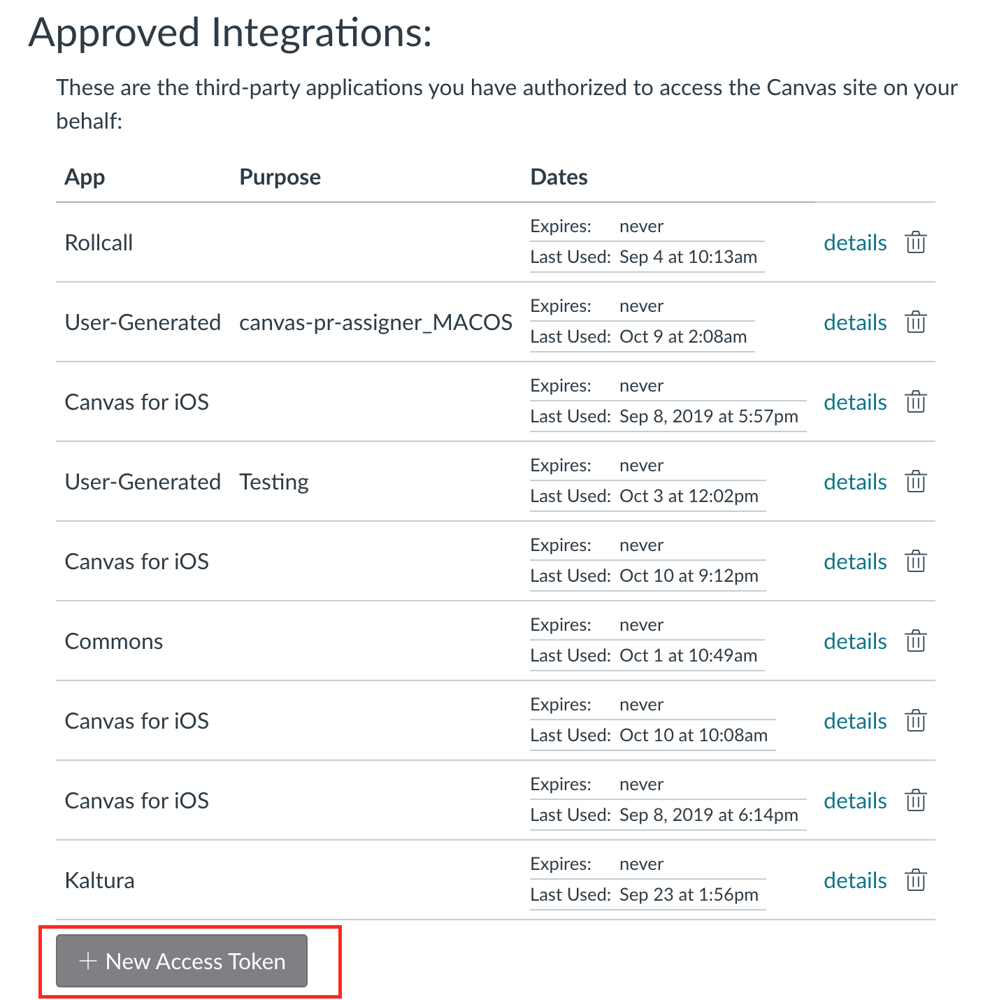
After clicking the button, a window for the token settings will appear. Give it a name, but leave the date field blank.
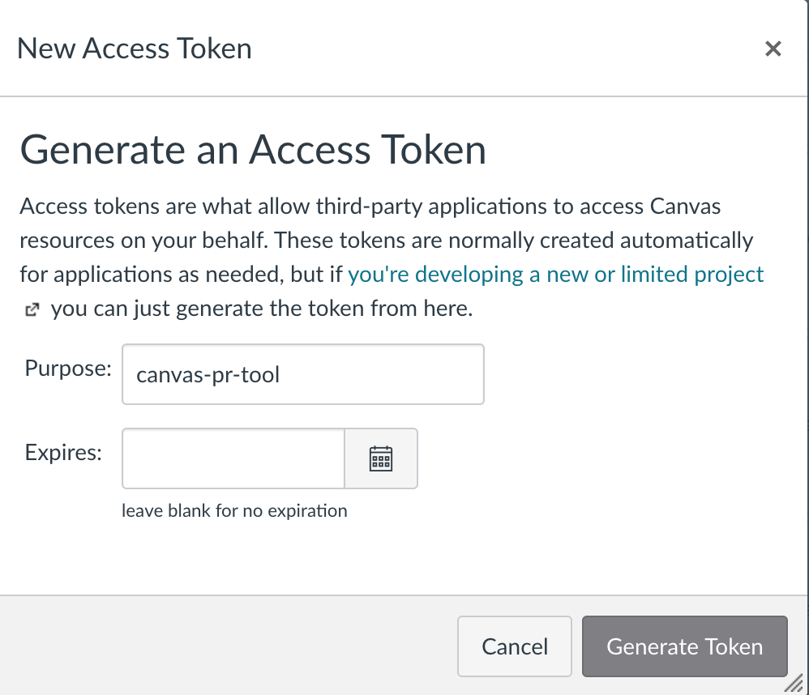
Copy the string that appears next to **Token**. You cannot view the token again after this screen, so make sure to save to a file.
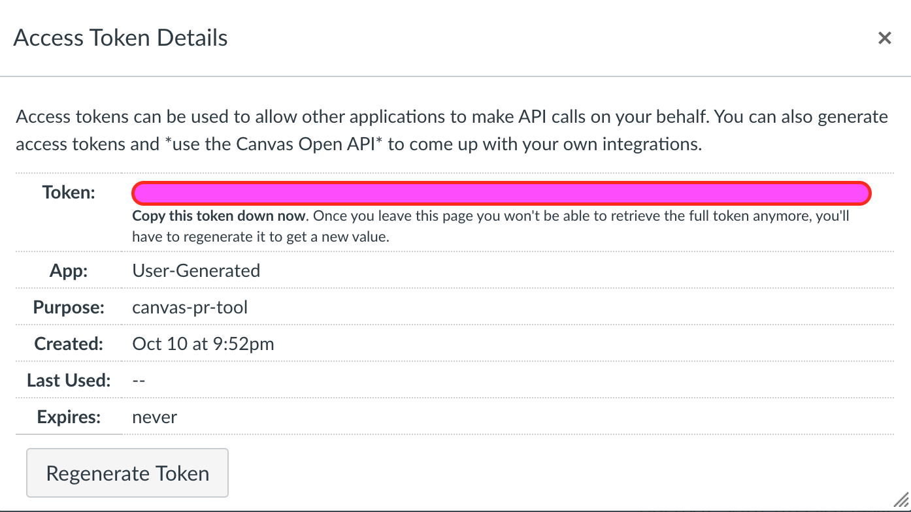
#### On Mac:
Open a program called **TextEdit**. Paste the string into the file, and save the file in the same directory as the program.
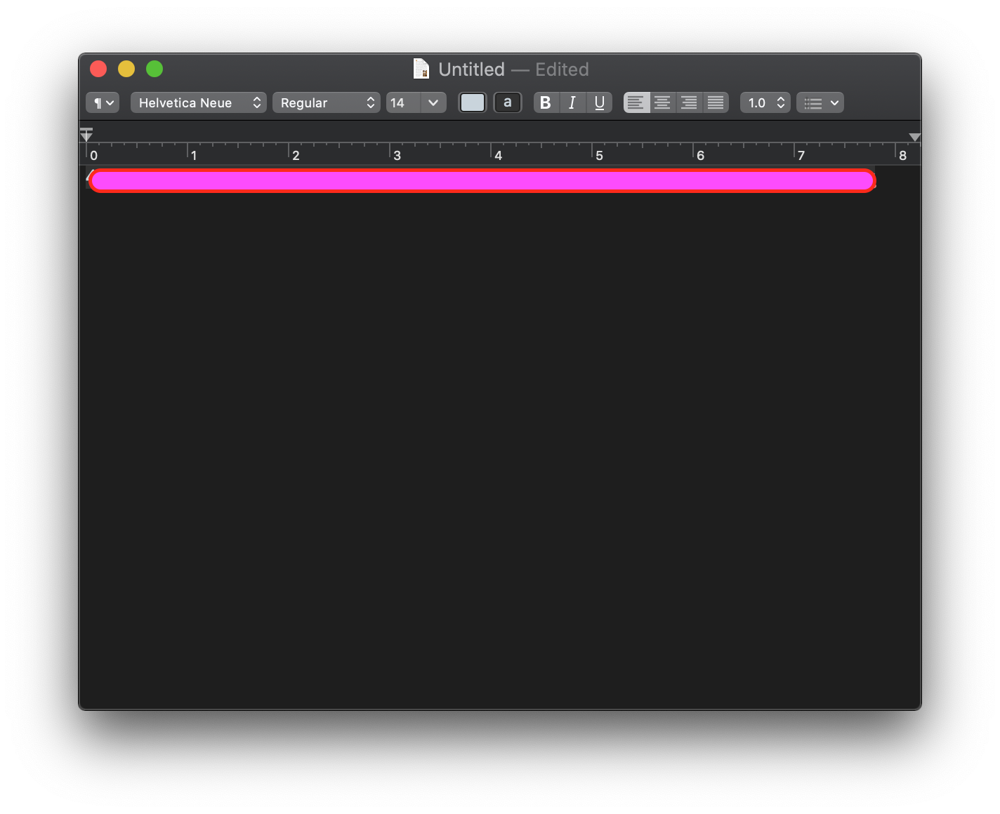
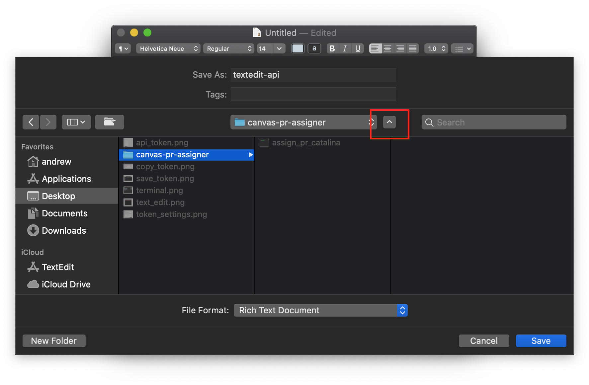
This information only needs to be obtained once. When using the tool in the future, use this file.

The folder for the tool will look like this:
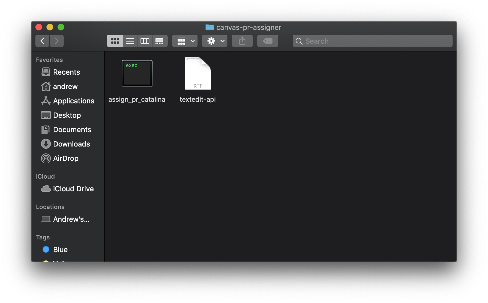

### 2. Course number

### 3. Assignment number

## Running the tool
### 1. Confirm tool folder contents
The API token text file needs to be in the same directory as the tool. The folder will look like this:

### 2. Open the "Terminal" program
On Macs, click on the magnifying glass on the top right of the screen and search for a program named **Terminal**.
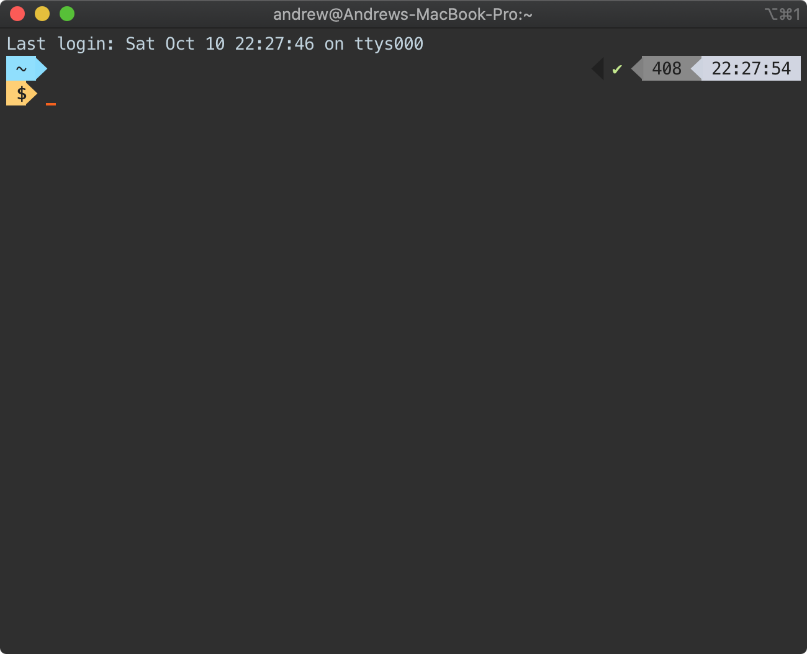

### 3. Move to the folder where the tool is located
For example, if the tool is located on the Desktop in a folder named **canvas-pr-assigner**, type `cd Desktop/canvas-pr-assigner`
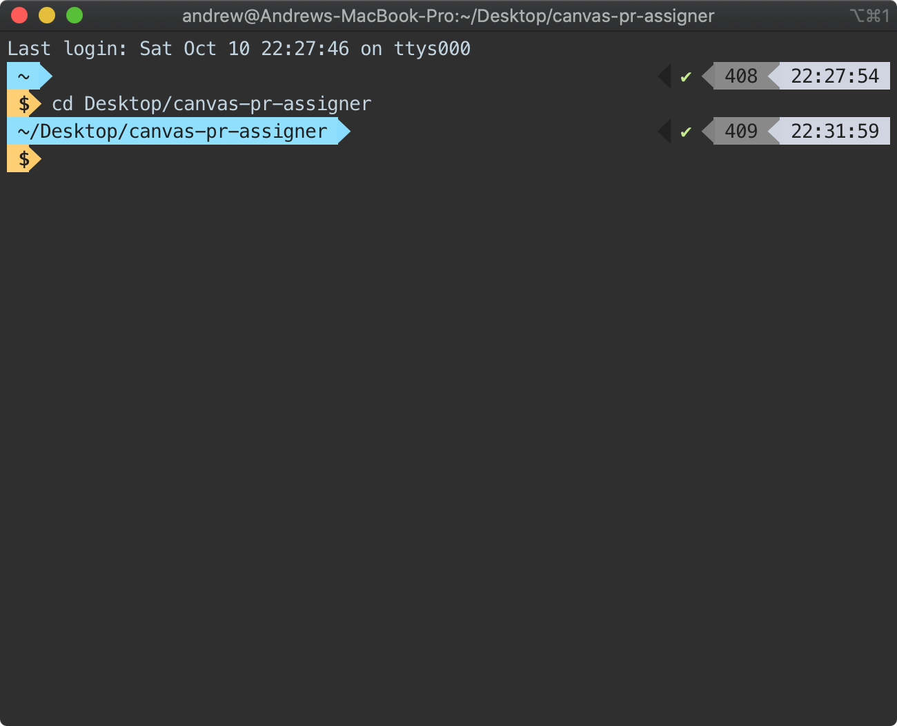

### 4. List the contents of the folder
Ensure that you have moved to the correct folder by typing `ls`
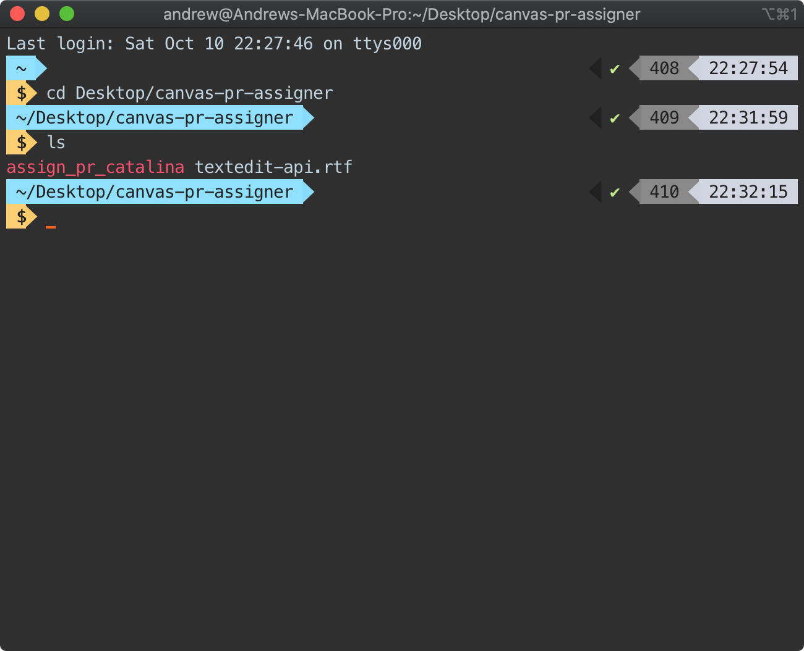

### 5. Grant execution permissions for tool
When you download the tool for the first time, it doesn't have permissions to execute. Give it permissions by typing `chmod +x assign_pr_catalina`. If you're using the Sierra version, type `chmod +x assign_pr_sierra`.
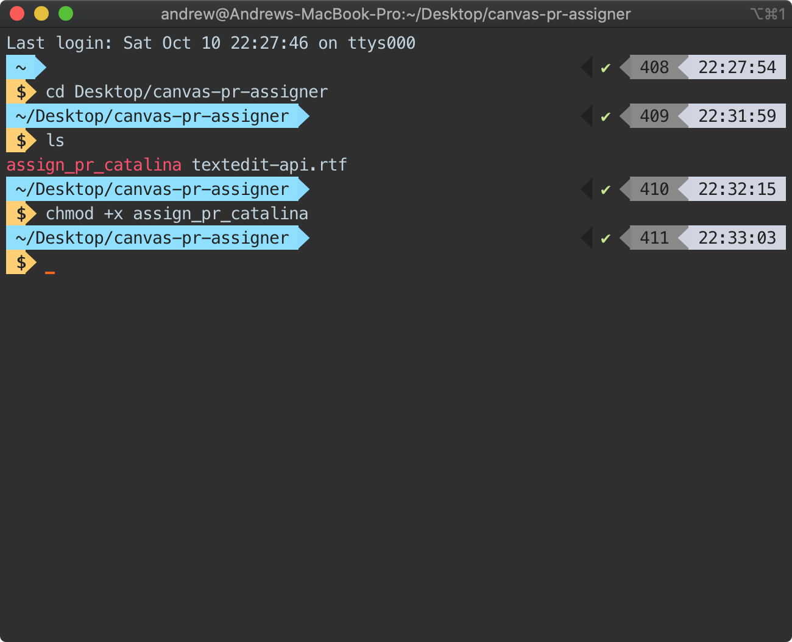

### 6. Execute the tool
To execute the tool, type `./assign_pr_catalina`. If using the Sierra version, type `./assign_pr_sierra`
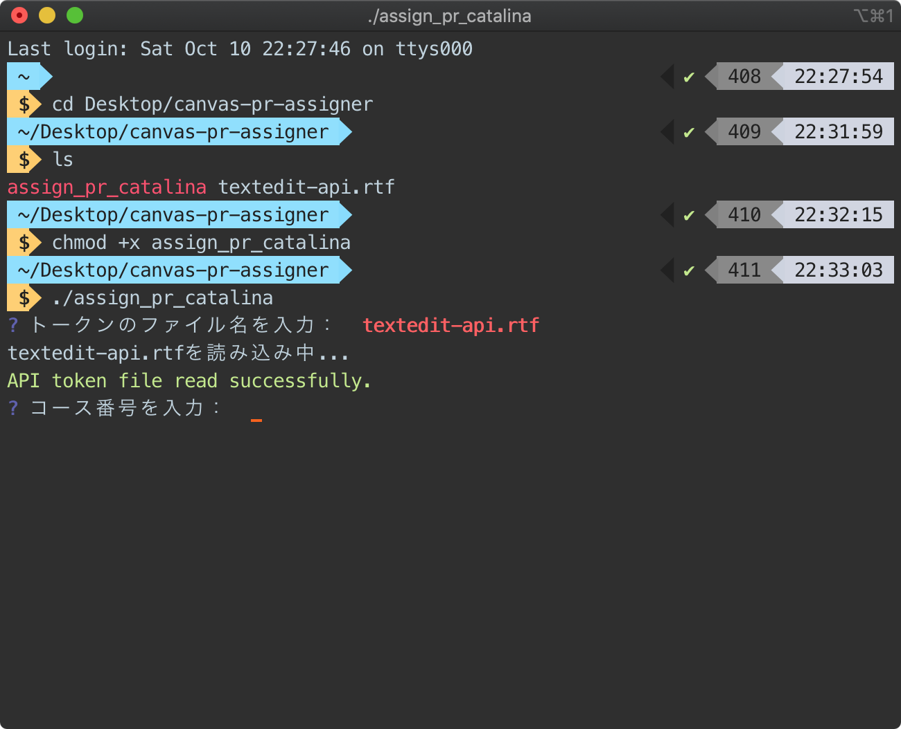
Enter the name of the API token file when prompted.

